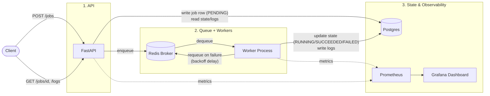

# Cloud-Native Job Orchestration Platform — One Pager

## Goals

- Build a backend platform where users submit long-running jobs, the system queues them, executes them with workers, tracks state, stores logs, retries failures, and exposes APIs.
- Serve as the primary portfolio project demonstrating backend/distributed-systems depth (job lifecycle, queueing, retries, observability) for job applications.
- Genuinely learn the underlying concepts — FastAPI, SQL/Postgres, and queueing are being learned as part of this project, not assumed knowledge.
- Hand-roll the core orchestration logic (retry with exponential backoff, timeout handling, state transitions) rather than relying on a framework like Celery to provide it, so the design can be explained and defended in interviews.

## Non-Goals

- Multi-tenancy / per-user isolation.
- Full auth or RBAC (a simple API key is the ceiling, and only if time allows).
- Kubernetes or any orchestration platform beyond Docker Compose.
- Horizontal autoscaling of workers.
- A polished frontend — the dashboard is minimal and read-only.

## High-Level Architecture

Three boxes:

1. **API** (FastAPI) — accepts job submissions, exposes job status/log endpoints, reads/writes Postgres. Enqueues onto Redis but does not implement execution or retry logic itself.
2. **Queue + Workers** (Redis broker + custom Python worker process) — pulls jobs off the queue, executes them, and owns all state-transition logic: PENDING → RUNNING → SUCCEEDED/FAILED, retries with exponential backoff, timeout handling.
3. **State & Observability** (Postgres + Prometheus/Grafana) — Postgres is the source of truth for job records and structured logs; Prometheus/Grafana sit on top for metrics and a dashboard.

Redis is used as a raw broker (lists/streams), not via Celery — the retry/backoff/timeout machinery is custom so it can be discussed and defended as original design work.

### Diagram

## Milestones

- **M0 — Scaffolding**: Docker Compose skeleton (Postgres up), FastAPI hello-world, CI skeleton (lint + test) running green on nothing.
- **M1 — Synchronous job CRUD**: `POST /jobs` writes a row, `GET /jobs/{id}` and `GET /jobs/{id}/logs` read it back. No queue yet — isolates learning FastAPI + Postgres from learning queues.
- **M2 — Queue + single worker**: Redis introduced as broker. Job flows PENDING → enqueue → RUNNING → SUCCEEDED/FAILED on a dummy task.
- **M3 — Retries & timeouts**: Hand-rolled retry with exponential backoff; timeout handling for long-running jobs.
- **M4 — Structured logging**: Logs tagged with `job_id`, persisted to Postgres, exposed via API.
- **M5 — Tests & CI**: Unit tests for the backoff/state-machine logic; integration tests against real Postgres/Redis in GitHub Actions.
- **M6 — Observability**: Prometheus metrics (queue depth, success/failure rate, durations) and a Grafana dashboard.
- **M7 — Stretch**: Deploy (Fly.io / Railway / AWS free tier); possible horizontal worker scaling; API-key auth.
